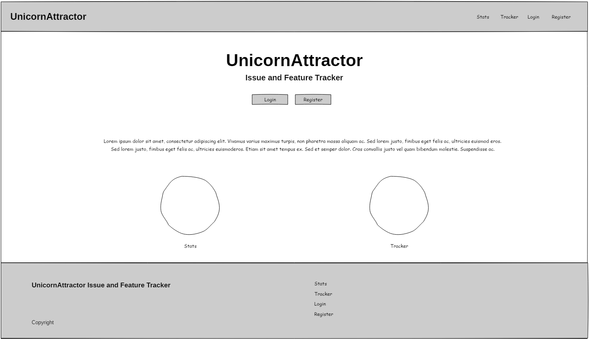
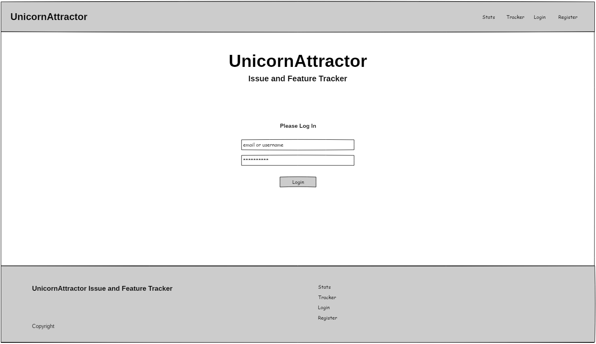
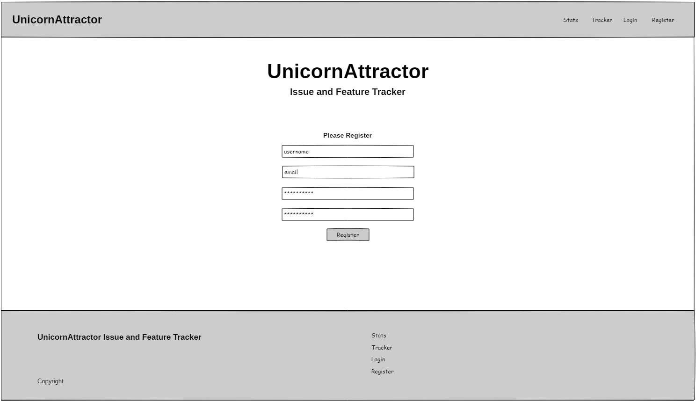
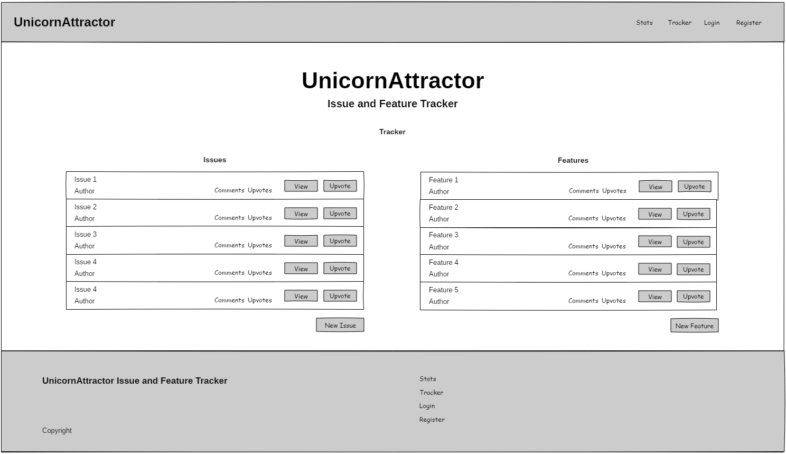
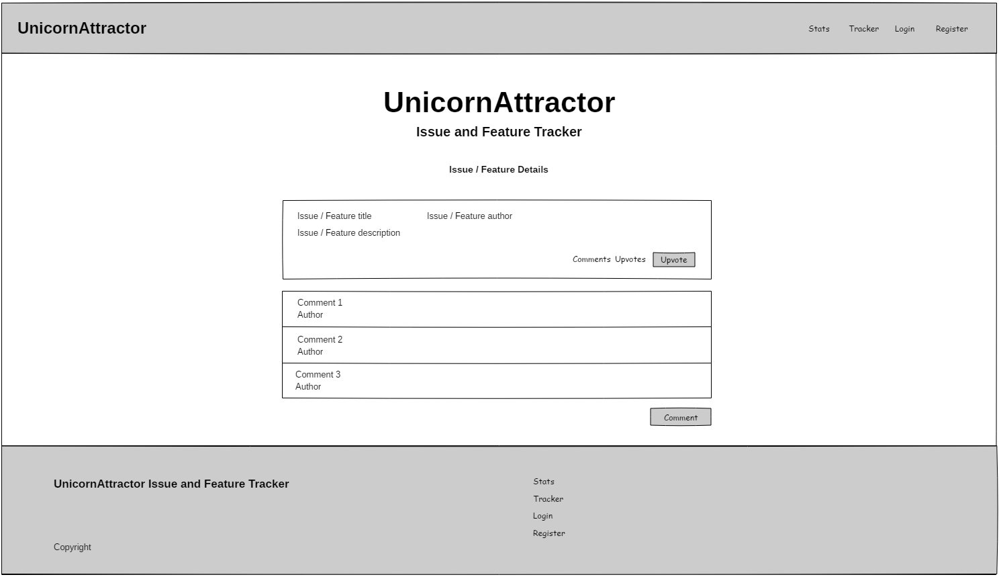
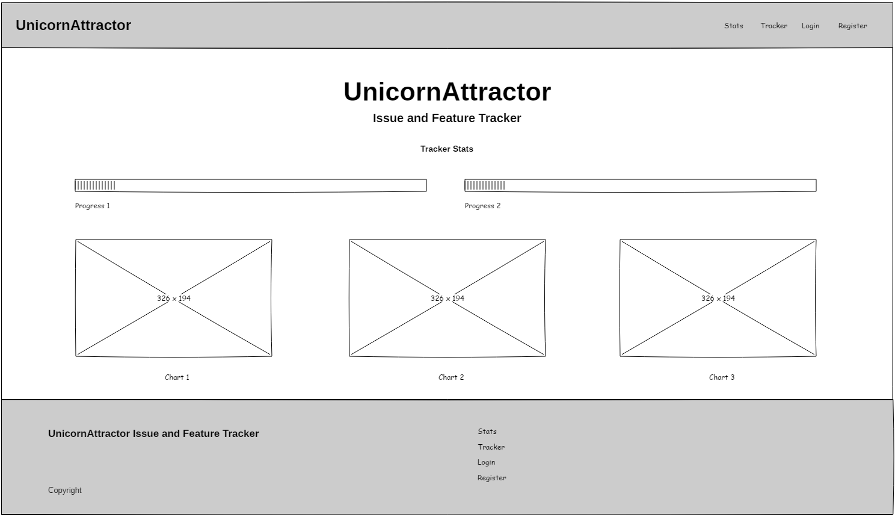
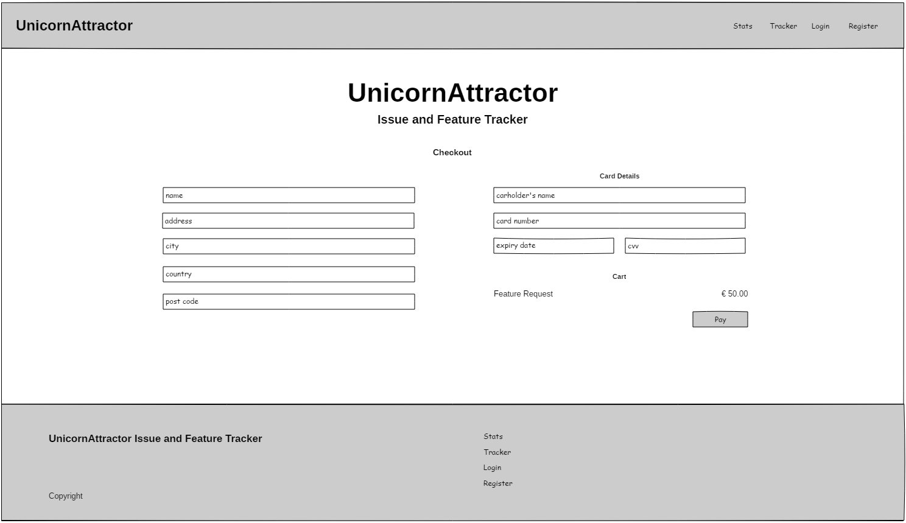

# Issue Tracker

A data driven full stack Django application that is an issue tracker for the fictional UnicornAttractor web app. It allows users to register and log in to report bugs or to request new features. Users can also upvote and comment on bugs and features. New feature requests and new feature upvotes requirement payment through a checkout system that uses Stripe. Users can also view statistics based on the bugs and features contained within the database as well as view their own payment history in their own profile page.

This application was deployed on Heroku and uses Python on the back-end with the Django framework, along with PostgreSQL for database services. It also uses the Bootstrap framework on the front-end, with Chart.js used for building dynamic charts for statistics.

Built for the final project in the Full Stack Software Development diploma course at Code Institute, in the Full Stack Frameworks with Django module.

The live project can be viewed [here](https://issue-tracker-kes.herokuapp.com/).
 

## UX

This application was built to allow users view and create issues (bug reports or new feature requests) for the fictional UnicornAttractor web app. It also allows to comment on and upvote on issues as they wish. The application provides a registration page for new users to register on the site, and a log in page to sign in after they have registered. If a user forgets their password they can access the password reset feature. Any visitor can browse the issues currently created on the site but logged in users, aside from adding new issues, can also comments on issues and use the "like" button system to upvote.

When viewing all issues on the site a user can search issues by title using a free text input, can filter all issues by status ('Pending', 'In Progress' or 'Closed') or sort all issues by title, upvote count or comment count, all in asceding or descending order. There is also a reset button to reset your sorting or filtering of the lists to its default state, which is ordered by creation date, most recent first.

Clicking on any issue will take the user to an issue detail page which provides a full description of the issue as recorded by the original poster. Visitors can view a list of comments from users relating to that issues, and all authentication users can comment on the issue or click a "like" button to upvote that issue.

For new feature requests, and to upvote on new feature requests already on the site, payment is required by the user. Once a user attempts to create a new feature on the site or upvote a new feature request on the site a modal will appear advising the user that a payment is required. They are then brought to a very clean and simple shopping cart allowing them to change the amount they wish to pay for any individual item, delete any item from their cart, or proceed to the checkout screen that again will provide them with a very clean and simple interface to enter their order details and card payment information. If a user logs out at any time while there are items still in their cart then once they log back in again that data will persist and their cart will have the same state they left it in the last time they were logged in. Users also have their own Profile page which displays all their bug reports, feature requests, feature upvotes where they can also see how much was paid, along with a total paid amount, as well as having a button to link them directly to the related feature for each record.

The site also provide a Statistics page where any user or visitor to view stats on the issue tracker application, including the time spent by developers across bug fixes and new feature development, the top votes bug reports and feature requests, as well as the history of the closing of issues by the developer team. These charts and graphs are generated dynamically when the page is requested so it will show the most up-to-date information.

##### User Stories

As a user I can:
- register as a user on the site
- log in to the site once registered
- change password to the site if I have forgotten my password
- add new bug reports to the site
- add new feature requests to the site
- click on a bug report to see a description
- click on a new feature request to see a description
- upvote on bug reports and/or on new feature requests
- comment on bug reports and/or feature requests
- view a list of bugs already reported on the site
- view a list of new features already requested on the site
- see how many upvotes a bug report or feature requests has received
- see how many comments a bug report or feature requests has received
- search the lists of bug reports or feature requests by title
- filter the lists of bug reports or feature requests by status ('pending', 'in progress' or 'closed')
- sort the lists of bug reports or feature requests by title, number of comments or number of upvotes
- filter the list of recipes by cuisine type
- view a statistics page showing stats on developer time, top bug reports and features requests, and progress/status of issues
- add new feature requests or upvotes for present feature reuqests to a shopping cart for payment
- process payment safely by simple card payment
- view a profile page with my basic user information

This site was built on the basis of ideas from initial wireframes created in [Pencil](https://pencil.evolus.vn/) and exported image files for can be found in the 'design' folder in the repo and can also be seen below:

##### Key Aspects of UX Development

- The "like" button system for upvoting issues is built in a way that when the issue detail page is requested the application will check on the back-end if the user has already upvoted on that issue, and if the user has then a HTML data attribute is given a value of `true` so that this status is visible to the user. If a user clicks the button again they remove their vote, or if they haven't previously upvoted the issue they will add a new vote. JavaScript code on the front-end will manage the state of the voting button by updating the appearance of the button and updating the vote status data attribute which will then be used to decide whether an 'add vote' or 'remove vote' POST request should be made accordingly to the server to add or remove the vote in the database.
- The comment field and the button to submit a new comment on the issue detail page will both be disabled when no user is logged in, or when an issue has already been closed. When a user is authenticated and the first is first loaded the comment input field will be active but the comment submit button will be disabled. When a user begins to type in the comment field the submit button will become active as long as there is at least one character typed into the comment input field. The state of the button is managed and updated by some front-end JavaScript and as well as being a feature that provides a smooth user experience it will also prevent empty comments being submitted when the JavaScript code on the front-end makes a POST request to the server with text string for that comment.
- On forms such as those for logging in, registering with the site, reporting a bug or creating a new feature request, the first field will be automatically focussed so the user can immediately begin typing.

## Features

##### Existing Features

- Feature 1 - ...
- Feature 2 - ...
- Feature 3 - ...

##### Future Features

- Feature 1 - ...
- Feature 2 - ...
- Feature 3 - ...

## Technologies Used

Languages, frameworks, libraries, and any other tools used to construct this project. 

- HTML 5
    - This project uses **HTML** to structure the content of the website.
- CSS 3
    - The project uses **CSS** to add additional styling to the site and refine responsive beahviour using media queries.
- [Bootstrap](https://getbootstrap.com/)
    - This project uses **Bootstrap** to provide the front-end grid framework and support responsive behaviour.
- JavaScript
    - The project uses **JavaScript** to add and remove content dynamically and to initialise Materialize components.
- [jQuery](https://jquery.com/)
    - This project uses **jQuery** to assist in DOM node selection and manipulation as well as in providing feedback to user interactions.
- [Python](https://www.python.org/)
    - This project uses **Python** as the server-side programming language to provide back-end logic and serve dynamic web pages to the browser.
- [Django](https://www.djangoproject.com/)
    - This project uses **Django** as the back-end framework to simplify configuration of the application and routing, to render HTML templates, work with client requests and to assist with user authorisation and authentication.
- [PostgreSQL](https://www.postgresql.org/)
    - This project uses **PostgreSQL** for databases services on the live application through the add-on provided through Heroku and for this I used the Psycopg PostgreSQL database adapter for the Python which can be found here [here](https://pypi.org/project/psycopg2/).
- [Stripe](https://stripe.com/)
    - This project uses **Stripe** to handle payments.
- [AWS S3](https://aws.amazon.com/s3/)
    - This project uses **AWS S3** storage service to store static files including all images, CSS stylesheets, JavaScript files and front-end code libraries used by the application.
- [Chart.js](https://www.chartjs.org/)
    - This project uses **Chart.js** to produce dynamic charts and graphs to provide statistics to users.

## Testing

This project was developed incrementally with regular use of `console.log` statements in JavaScript and the `print()` function in Python to repeatedly check the changes made in the application and to ensure all changes to source code were providing the desired outcome in the browser. The site was build using Google Chrome browser (version 76) and then later tested in other browsers; FireFox (version 67) and Edge (version 42).

This project was tested for responsiveness using the Chrome Developer Tools mobile device simulator. It was also viewed on physical Samsung Galaxy A5 (2017) mobile device to ensure good responsive behaviour. The site was also tested in Mozilla Firefox (version 67) and Microsoft Edge (version 42) browsers to ensure appearance and functionality of the site was as expected across all 3 of these browsers.

...

Continuous Integration testing was done on each code push to the main project repo using [Travis-CI](https://travis-ci.org/). The current build status can also be seen on the badge at the top of this README document.

## Deployment

GitHub was used for version control throught the development of the application and to host the code by pushing all code to the repo on GitHub.

This project was then deployed to Heroku to host the live application, following the steps below:

1. Log in to [Heroku](https://www.heroku.com/) and create a new app called 'issue-tracker-kes'
2. Log in to Heroku in the CLI
3. Add the remote Heroku repo
4. Create the `requirements.txt` file by running `pip freeze > requirements.txt` in the CLI
5. Create a `Procfile` by running `echo web: gunicorn issue_tracker.wsgi:application > Procfile` in the CLI
6. Set up S3 Bucket on AWS and update static file storage settings in the project's `settings.py` file
7. Collect all static files in the new AWS S3 storage object using the `python manage.py collectstatic` command in the CLI
8. Add Heroku app URL to the project's `ALLOWED_HOSTS` list 
9. Set environment variables in Heroku for the project's `SECRET_KEY`, `DATABASE_URL`, and `DJANGO_SETTINGS_MODULE`; `AWS_ACCESS_KEY_ID`, `AWS_SECRET_ACCESS_KEY`; and `STRIPE_PUBLISHABLE` and `STRIPE_SECRET` keys and values
10. Set up Travis-CI for continuous integration testing and link to the project's GitHub repo
11. Push all code to remote Heroku repo
12. Restart all dynos on Heroku
13. Heroku account then connected to GitHub repository and set to automatically deploy from the repo's master branch to retrieve all code updates

The live project can be viewed [here](https://issue-tracker-kes.herokuapp.com/).

## Download & Run Locally

To download and run an instance of this project locally you should follow these steps:

1. Download all code from this repo either by cloning the repo or simply downloading and unzipping the .zip file
2. Run `pip install -r requirements.txt` in the CLI to install all required packages for the Django app
3. Set up a Stripe account (if you have none already) and record the Test values for Publishable and Secret keys
4. You will not necessarily need to use AWS S3 storage to run the project locally so you can comment out lines 142 - 154 inclusive in the `settings.py` file to leave the local static folder as the folder for static file storage
5. Create an `env.py` file in the project's root folder and uncomment the import of this file in the settings.py file
6. In the `env.py` file you use `os.environ.setdefault('<KEY>', '<VALUE>')` to set the environment variable's keys and values for:
    - `SECRET_KEY` (You can generate your own Secret Key [here](https://www.miniwebtool.com/django-secret-key-generator/))
    - `DJANGO_SETTINGS_MODULE` (value should be `issue_tracker.settings`)
    - `STRIPE_PUBLISHABLE`
    - `STRIPE_SECRET`
    _You should also set an environment variable called DEVELOPMENT with a value of 1 as there is logic in the `settings.py` file which will determine whether the project is being run in development or production, which will then determine if DEBUG mode should be True or False and also whether the local Django SQLite database should be used for the development environment._
7. Run `python manage.py createsuperuser` to create a Super User for the application who will be able to access the application's Admin dashboard
8. Run `python manage.py makemigrations` in the CLI to create migration files for the local database instance
9. Run `python manage.py migrate` to migrate those migrations to your local SQLite database
10. Run `python manage.py runserver localhost:8080` to run the local development server and then go to localhost:8080 in your browser

Please be aware that running your own local development version of the application will start with an empty database so you will have no recorded bugs or feature requests meaning you may need to create a number of dummy bugs and feature requests to experience the functionality available in the project, including the dynamic generation of charts and graphs on the 'Stats' page of the app.

The management of reported bugs and features is intended to be done through the project's Admin dashboard which can only be accessed by a Super User. This issue managements in the Admin dashboard involves updating and changing the status of individual issues, ie. from 'Pending' to 'In Progress', or 'In Progress' to 'Closed', and also setting the 'Date Closed' value on any given issue. This data impacts the generation of the statistics-based charts and graphs.

## Credits

#### Acknowledgements

Aside from the Code Institute course content I found the following resources to be beneficial while completing this project:
- The Django tutorial by The Net Ninja on YouTube was very helpful as an additional resource for learning the basics of Django, the playlist for which can be found [here](https://www.youtube.com/playlist?list=PL4cUxeGkcC9ib4HsrXEYpQnTOTZE1x0uc)
- The official Django documentation, found [here](https://docs.djangoproject.com/en/2.2/)
- The [Chart.js official documentation](https://www.chartjs.org/docs/latest/) and the ['Getting Started with Chart.js'](https://www.youtube.com/watch?v=sE08f4iuOhA) video tutorial on YouTube by Traversy Media were great for getting up and running quickly with Chart.js
- The JavaScript code to retrieve the CSRF token from a cookie in order to make POST requests to the back-end was based on responses to a question raised on StackOverflow [here](https://stackoverflow.com/questions/55864156/how-can-i-solve-csrf-verification-failed)
- The [Yeti theme](https://bootswatch.com/yeti/) from Bootswatch was used with Bootstrap for development of the UI
- Finally, thank you to my mentor Aaron Sinnott for his advice and guidance throughout the project

## Contact

If you have any questions or comments relating to this project you can contact me by email at [keithscully83@gmail.com](mailto:keithscully83@gmail.com)